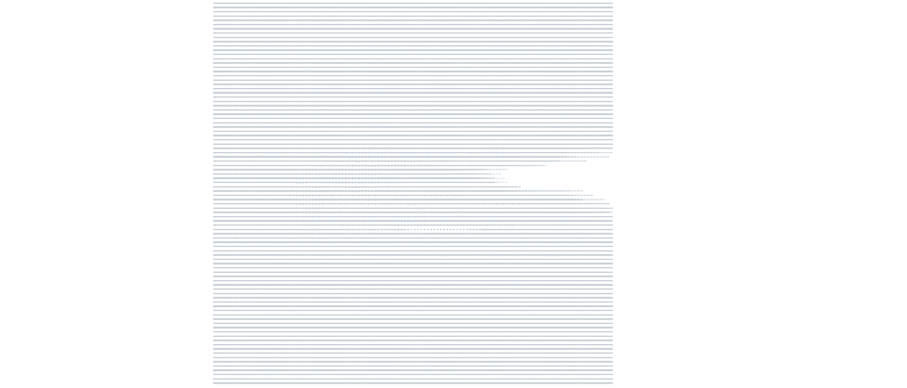
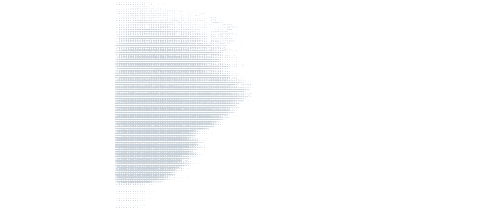

# GIF/Video → Animated ASCII SVG (GitHub‑Friendly)

I created this project to showcase how you can turn any GIF or video into a fully animated SVG made entirely out of ASCII art.  
The final SVG plays directly inside GitHub's README without JavaScript, images, or external hosting. All you need is Python, rest is extra.

## Planned Features
- Make an interface that let's you dial your settings & drag and drop files 
- Allow user to stack animations in an output folder, instead of overwriting them
- Add several different building methods that can be tried if build fails
- Make our own GIF/Video → ASCII Converter

Below is the full process so anyone can recreate it.

---

## 1. Start with any GIF or video
Pick a short clip. High contrast works best for ASCII.

---

## 2. Convert the video to a GIF if needed
Use this tool: https://ezgif.com/video-to-gif
This gives you a frame‑by‑frame animation that our ASCII tool can process.

---

## 3. Create a URL for the GIF
The next tool we will be using will need the GIF in a URL format to convert it to ASCII art.

Personally, I chose to upload my GIF to Imgur using [ShareX](https://getsharex.com/). Fast and easy, no logging in.
You just shift right click the GIF and choose "Upload with ShareX", GIF's should get uploaded to Imgur by default, the link will be pasted into your notepad automatically.

In a pinch, you could also share the GIF to yourself on Discord and copy the link from there.

---

## 4. Convert the GIF into ASCII frames
Go to: https://asciigif.com/ (shoutout to [JayRichh](https://github.com/JayRichh/ascii) for creating the website)

Paste the GIF URL you got in the previous step.
Choose "ASCII text" as the output format.
This gives you a `.txt` file, save it as `frames.txt`. 

Now you should count the number of lines each "frame" has to get it's height, as well as the number of characters per line to get it's width. This is needed so that the script knows where each frame is and how big they are.

In my case:
- Each frame was 91 lines tall
- Each line was 91 characters wide
- Frames are separated by one blank line

You should add your line height, character width and any other preferred values at the top of svg_build.py

---

## 5. build the SVG animation
Run svg_build.py to create your own animation.svg that you can insert into your README.
If you are not satisfied with the results, you can tinker with the settings at the top of svg_build.py and repeat this step until you're happy with the results.

---

## 6. (Optional) Clean the ASCII file
ASCII files often contain heavy characters like @ and % that dominate the background of the image.
I've included an svg_cleaner.py that removes every @ and % from ALL frames of the animation.
You can edit said svg_cleaner.py to remove or replace whatever characters you want.
This will create a separate copy of your frames called frames_clean.txt
Now paste your previously applied settings from the svg_build.py into svg_build_clean.py
Then run svg_build_clean.py to create your own animation.svg

---

---

## License
© Copyright 2026 Topromm. All rights reserved.
